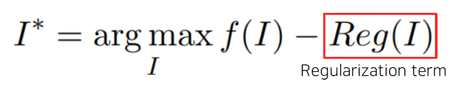

## 6. CNN_Visualization

: CNN을 시각화함

### 1. VIsualizing CNN

기본적으로 CNN은 Black box 

visualization tool은 debugging tool을 갖춘 것과 마찬가지! -> 매우 중요한 기술

CNN의 layer 별 어떻게 보고 있는지 확인 가능!

Analysis of model behaviors: 모델 자체의 행동을 분석

Model decision explanation: 모델의 출력을 분석하는 방법

### 2. Analysis of model behaviors

: high level feature layer를 통과한 애들을 볼거임(FC layer 들어가기 직전!)

Nearest neighbors in a feature space

차원축소법

**t-SNE(t-distributed stochastic neighbor embedding)**

: 대표적인 차원축소법! 자세한 설명은 워낙 유명해서 따로 찾아봐도 됨

: high layer에서 쓰이는 방법론

**Layer activation**

: mid와 high 사이에서 활용되는 방법

**Maximally activating patches**

: mid에서 활용되는 방법 -> hidden nodes를 찾는 방법

1. 분석하고자 하는 특정 layer를 정함
2. 그 채널의 image를 activation map에 기록
3. 가장 큰 값을 가지는 부분(maximum)을 파악하고 그 부분을 crop하여 뜯어옴

**Class visualization-Gradient ascent**

: 최적화 방법 중 하나!

1. 먼저 dummy image로부터 prediction score 얻기
2. 역전파를 입력까지 내려가서 target score가 높아지는 input image를 업데이트해줌
3. 현재 image를 업데이트 해줌

### 3. Model decision explanation

**Saliency test**

- occlusion map (일부분을 가려주는 효과)

: 교재 확인하기!

일부분을 가려줌으로서 어느 부분이 중요한 부분인지 판단 가능!

- via backpropagation

1. 입력 이미지를 넣어줌
2. 입력도메인까지 역전파 진행
3. 이미지 변형을 통해 visualize

**Rectified unit**

**Guided backpropagation**

- comparison

**Class activation mapping (CAM)**

: 다른 방법론 보다 압도적인 성능을 보여줌

**gradcam**

: heatmap을 활용하여 detection을 해줌

: activation map까지만 역전파를 진행

: sharp하지만 class에 대한 구분성이 떨어짐

**SCOUTER**

: 왜 아닌지까지 heatmap을 통해 설명을 해주는 viz

**GAN dissection**